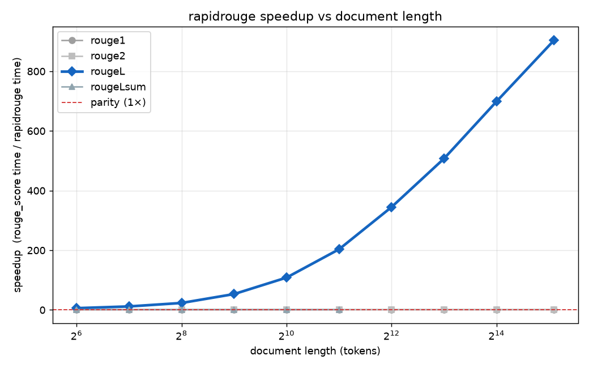

# rapidrouge

> ⚠️⚠️⚠️ This repository was build with AI ⚠️⚠️⚠️

**A fast, pure-Python drop-in replacement for [`rouge-score`](https://pypi.org/project/rouge-score/).**

```bash
uv add rapidrouge          # pure-Python, ZERO runtime deps — installs anywhere
```

Optional extras: `rapidrouge[stemmer]` (nltk, for `use_stemmer=True`),
`rapidrouge[aggregate]` (numpy, for `BootstrapAggregator`), or `rapidrouge[full]`.

Same import, same results as `rouge_score` 0.1.2 — ROUGE-L's
LCS length is computed with the **Hyyrö bit-parallel algorithm**, so it's far faster
on long documents:

```python
from rapidrouge import rouge_scorer
scorer = rouge_scorer.RougeScorer(["rouge1", "rougeL"], use_stemmer=False)
scorer.score("the quick brown fox", "quick brown the fox")["rougeL"].fmeasure  # 0.75
```

## Benchmarks

ROUGE-L is where the bit-parallel kernel pays off, and the win **grows with document length**. From ~10× on a sentence to **~900× on a 35k-token document** (115 ms vs ~104 s), with results identical to `rouge_score`:



It's a memory win too: the reference fills an O(n·m) DP table (~9.8 GB at 35k tokens), while rapidrouge's LCS is O(n). `rouge1`/
`rouge2` (n-gram counting) and `rougeLsum` (still a DP table) match the reference in both correctness *and* speed (~1×), as expected — only ROUGE-L rides the Hyyrö kernel. 


## License

Apache-2.0. Portions derived from `rouge_score` (Apache-2.0); see `NOTICE`.
